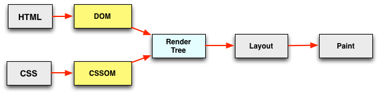

autoscale: false
build-lists: true
theme: simple, 2


---


^Funny thing about hammers - there are more things you can break with a hammer than you can fix with a hammer

---

# A hammer, in CSS

```css
#sidebar .post .meta > a.author {
	text-decoration: underline !important;
	color: var(--c-textSecondary) !important;
	font-style: italic !important;
}
```

^Selecting an element and bludgeoning it with style properties until it looks right
^It is a blunt instrument for styling, and usually does more damage than good

---

```css, [.highlight: 1]
#sidebar .post .meta > a.author {
	text-decoration: underline !important;
	color: var(--c-textSecondary) !important;
	font-style: italic !important;
}
```

---

 [^1]

[^1]: https://specificity.keegan.st/

^This is often done intentionally to override other styles

---

```css, [.highlight: 2-4]
#sidebar .post .meta > a.author {
	text-decoration: underline !important;
	color: var(--c-textSecondary) !important;
	font-style: italic !important;
}
```

# [fit] :fire: `!important` :fire:

---

* Most of us have seen CSS like this
* Many of us have _written_ CSS like this
* _I have written CSS like this_

---


# Adam Detrick
## _@akdetrick_

## **I work for [Meetup](www.meetup.com)**

---

# [fit] Why do we reach for a hammer
# [fit] when we should know better?

---

# Because the existing stylesheet...

* Is not documented
* Is too big
* Has lost control of specificity and cascade

---

# [fit] Because of the existing stylesheet.

---

> It’s harder to read code
> than to write it.
-- Joel Spolsky

^CSS presents its own layer of extra difficulty

---

# Why is CSS a blocking resource?

[^2]

[^2]: Grigorik, I. - Deciphering the Critical Rendering Path. Retrieved from https://calendar.perfplanet.com/2012/deciphering-the-critical-rendering-path/

---


# **You can't serialize thousands of lines of CSS in your head**

---

# Assigning blame is not helpful

* CSS is a fundamentally flawed language
* Browsers are bad
* I'm just bad at CSS
* My organization is bad at CSS

---

# [fit] **CSS**
# [fit] **is hard**
# _(for humans)_

---

## CSS has a tendency to grow over time

* existing CSS is hard to document
* difficult to understand the intention of others
* poor relationship between design and engineering teams
* deadlines
* we introduce styles that have side effects

^A few of these are technical problems, but most are "people problems"

---

## [fit] technical problems
## [fit] !==
## [fit] people problems

^We often misidentify a "people problem" as a technical problem, and not all technical problems are best solved with technical solutions
^If you ignore people problems, you can't fix them

---


---

# _Conway's Law_

> organizations which design systems ... are constrained to produce designs which are copies of the communication structures of these organizations
-- Melvin Conway. _"How Do Committees Invent?"_ 1968

---

# BLOAT CYCLE
team A doesn't know that team B already did a thing like this

---

# BLOAT CYCLE
deadline, just override to get it done

---

# BLOAT CYCLE
we have 12 components that do the same thing and I can write a better one

---

# BLOAT CYCLE
design inconsistency

---

# The goal:
# [fit] **WRITE LESS CSS**

---

# CLASSES part 1
"make it less necessary to open a CSS file in the first place"

---

# CLASSES part 2
"style by memory with classes"
- introduce expressive CSS

---

# CLASSES part 3
if you're feeling uncomfortable with "unsemantic classes" in markup...

1. show code example with some class names
2. then remove a class or two - "does this feel better?"
3. show the extra CSS you have to write to support it

**Write less css!!**

---

# On loose coupling
"separate style from markup"

0. show introduction to coupling (abstract discs needing to know about each other)
1. show WLC slides from gotham sass talk on coupling

"as soon as we start introducing ancestry in our CSS, you create a two-way dependency."
(show the "extra CSS" example from the previous slide)

---

# Our utility classes look like this

(show flush modifiers and stuff from sasstools)

**Style from memory**

* easy to remember naming convention (like BEM, but no underscores)

---

# We have also created useful abstractions
like `text--display[n]` and `media--m`

* helps foster consistency
* style from memory

---

# [fit] Foster a better relationship between engineering and design


^Maybe mention the previous "bridging the gap" presentation at dotCSS
^You can't create useful abstractions without cooperation from design

---

# Common engineering complaints about design

* designs are inconsistent
* specifications are unclear
* designers are fixating on weird details

---

# Common design complaints about engineering

* production does not match what was designed
* engineers say "no" to everything
* engineers ignore the important details

---

# Design relationship part 1

* Speak the same language
* root your abstractions in what best fosters cross-team communication
* debate, then **decide** together
* create a sense of shared ownership

---

#### TODO:

CSS is declarative

* all the moving parts of an imperative language can be read and understood in code
* with a declarative language, the "moving parts" are everything that happens outside the code
    - business requirements
	 - team dynamics
	 - design decisions
	 - company organization (conway's law!)
