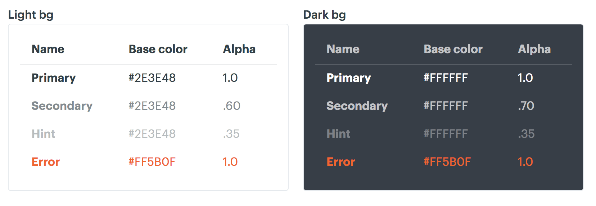

autoscale: false
build-lists: true
theme: merriweather, 7


---


^Funny thing about hammers - there are more things you can break with a hammer than you can fix with a hammer

---

# A hammer, in CSS

```css
#sidebar .post .meta > a.author {
	text-decoration: underline !important;
	color: #0366d6 !important;
	font-style: italic !important;
}
```

^Selecting an element and bludgeoning it with style properties until it looks right
^It is a blunt instrument for styling, and usually does more damage than good

---

```css, [.highlight: 1]
#sidebar .post .meta > a.author {
	text-decoration: underline !important;
	color: #0366d6 !important;
	font-style: italic !important;
}
```

 [^1]

[^1]: https://specificity.keegan.st/

^This is often done intentionally to override other styles

---

```css, [.highlight: 2-4]
#sidebar .post .meta > a.author {
	text-decoration: underline !important;
	color: #0366d6 !important;
	font-style: italic !important;
}
```

# [fit] :fire: `!important` :fire:

^Clearly, someone was trying to select one specific element, in a specific area, on a specific page, to bludgeon it with styles until it looked correct

---

# [fit] _just make it work_

---

# CSS debt cycle
"this CSS is too complicated" -> make it more complicated -> GOTO 0

---

* Most of us have seen CSS like this
* Many of us have _written_ CSS like this
* _I have written CSS like this_

---


# Adam Detrick
## _@akdetrick_

## **I work for [Meetup](www.meetup.com)**

---

# [fit] Why do we resort to using CSS as a blunt instrument?

---

> It’s harder to read code
> than to write it.
-- Joel Spolsky

^CSS presents its own layer of extra difficulty

---

> CSS is especially difficult to read
-- Me, right now on stage

---

# CSS is a render blocking resource.

[^2]

[^2]: Grigorik, I. - Deciphering the Critical Rendering Path. Retrieved from https://calendar.perfplanet.com/2012/deciphering-the-critical-rendering-path/

^CSS blocks this process until it is fully downloaded and parsed.

---


---


# **it's hard to build a complete mental model of the cascade when reading CSS**

---

# [fit] **READING CSS**
# [fit] **IS HARD**

---


## [fit] technical problems
## [fit] !==
## [fit] human problems

^We often misidentify a "people problem" as a technical problem, and not all technical problems are best solved with technical solutions
^If you ignore people problems, you can't fix them

---

# _Conway's Law_

> organizations which design systems ... are constrained to produce designs which are copies of the communication structures of these organizations
-- Melvin Conway. _"How Do Committees Invent?"_ 1968

---

# Code reflecting communication structure
team A doesn't know that team B already did a thing like this

**Find SDS pitch presentation!**

---

# CSS debt cycle
we have 12 components that do the same thing and I can write a better one

---

# CSS debt cycle
deadline, just override to get it done

---

# CSS debt cycle
design inconsistency

---

# [fit] How do we break the cycle?

---

# Make it your goal to
# [fit] **WRITE LESS CSS**

---

## Breaking the cycle

* start thinking about the developer experience
* focus on the decision point at which developers need to add more CSS
* reduce design fragmentation

---

## Utility classes

(flush modifiers)
"if these classes already exist and are easier to remember, you don't have to write extra CSS"

---

# Benefits of utility classes

* small, sharp tools
* quickly assemble layouts in markup instead of writing styles from scratch
* apply classes to markup instead of selectors to CSS
* allows developers to write less CSS
* "style by memory"

---


---

Core concepts of Expressive CSS

* AKA "functional CSS"
* Classes are for styling. Tags are for semantics.
* Class names should be understandable at a glance
* Portability / Referential transparency
* _Spend less time writing CSS_

---

## Content-derived class names

```html
<div class="event">
	<h1 class="event__title">Star Wars: The ...
	<p class="event__date">Dec 20, 2015</p>
	<p class="event__location">Ritz East, Phil...
</div>
```

---

## Expressive CSS presentational classes

```html
<div class="pos-bottom pos-left text-white">
	<h1 class="text-reg pad-2-top">Star Wars: The ...
	<p class="bold">Dec 20, 2015</p>
	<p class="text-small">Ritz East, Phil...
</div>
```

---

# Presentational classes are scary

* _"there are too many class names in one element, and the class name doesn't   describe the actual meaning [of the content]"_
* _"I hope this is a cruel joke that you're trying to play on people, because this sounds like the worst idea I've ever seen for CSS! You may as well be writing all your CSS with inline style tags."_
* _"What's this shit. You write CSS like 5 years ago."_

---

```html
<div class="pos-bottom pos-left text-white">
	<h1 class="text-reg pad-2-top">Star Wars: The ...
	<datetime class="bold">Dec 20, 2015</datetime>
	<p class="text-small">Ritz East, Phil...
</div>
```

---

```html
<div class="event">
	<h1>Star Wars: The ...
	<datetime>Dec 20, 2015</datetime>
	<p>Ritz East, Phil...
</div>
```

---

```css
.event { ... }
.event h1 { ... }
.event datetime { ... }
.event p { ... }
```

---

# Don't forget to
# [fit] **WRITE LESS CSS!**

---

# Who needs to read `class` attributes?

* __Users?__ Other attributes (`rel`, `role`, `title`, `alt`) are more useful than `class`
* __Machines?__ Tag choices and microdata (`itemscope`/`itemprop`) are more descriptive than `class`
* __Developers!__ The `class` attribute is most useful to developers building features

---

# Level of abstraction

Too specific:

```css
.border--top--black--4px { ... }
.padding--left--21px { ... }
```
<br />

Just right:

```css
.text--display1 { ... }
.media--xl { ... }
```

---



---

# Foster a good relationship between engineering and design


^You can't create useful abstractions without cooperation from design

---

# Design & Engineering

* Speak the same language
* Create a sense of shared ownership

---


---

```js
{
	"color": {
		"text": {
			"primary": { "value": [46, 62, 72, 1] },
			"secondary": { "value": [46, 62, 72, 0.60] },
			"hint": { "value": [46, 62, 72, 0.35] },
			"primaryInverted": { "value": [255, 255, 255, 1] },
			"secondaryInverted": { "value": [255, 255, 255, 0.70] },
			"hintInverted": { "value": [255, 255, 255, 0.35] }
		}
	}
}
```

---

```js
	"scss": {
		"transforms": [
			"attribute/cti",
			"name/cti/prefixC",
			"color/optimizedRGBA"
		],
		"buildPath": "./dist/",
		"files": [
			{
				"destination": "scss/_colors.scss",
				"format": "scss/variables"
			}
		]
	}
```

---

```scss
$C_textPrimary: rgb(46,62,72);
$C_textSecondary: rgba(46,62,72,0.6);
$C_textHint: rgba(46,62,72,0.35);
$C_textPrimaryInverted: rgb(255,255,255);
$C_textSecondaryInverted: rgba(255,255,255,0.7);
$C_textHintInverted: rgba(255,255,255,0.35);
```

---

```js
exports.C_TEXT_PRIMARY = 'rgb(46,62,72)';
exports.C_TEXT_SECONDARY = 'rgba(46,62,72,0.6)';
exports.C_TEXT_HINT = 'rgba(46,62,72,0.35)';
exports.C_TEXT_PRIMARYINVERTED = 'rgb(255,255,255)';
exports.C_TEXT_SECONDARYINVERTED = 'rgba(255,255,255,0.7)';
exports.C_TEXT_HINTINVERTED = 'rgba(255,255,255,0.35)';
```

---


---

# [fit] Static documentation is
# [fit] a lie waiting to happen

---

# To write less CSS...

* recognize why humans are bad at maintaining CSS
* style with utility classes
* root your abstractions in what best fosters communication

---

# [fit] CSS is better when
# [fit] you write less of it

---


**Expressive CSS**
[johnpolacek.com/content-display-patterns/](http://johnpolacek.com/content-display-patterns/)

<br />
**Relevant Meetup projects:**
[github.com/meetup/swarm-sasstools](https://github.com/meetup/swarm-sasstools)
[github.com/meetup/swarm-constants](https://github.com/meetup/swarm-constants)

<br />
**Meetup tech blog:**
[medium.com/making-meetup](https://medium.com/making-meetup)

_**@akdetrick**_
